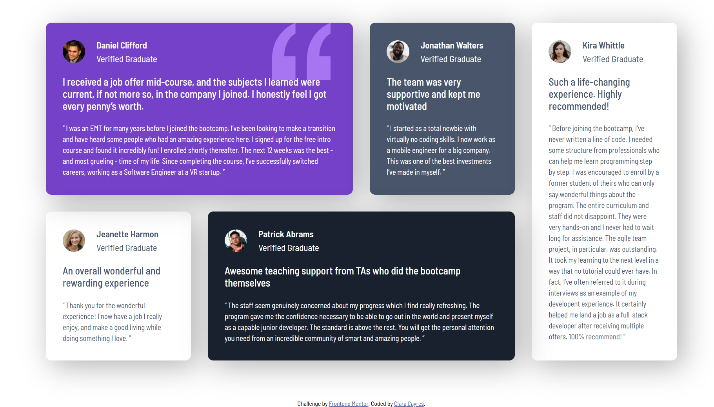
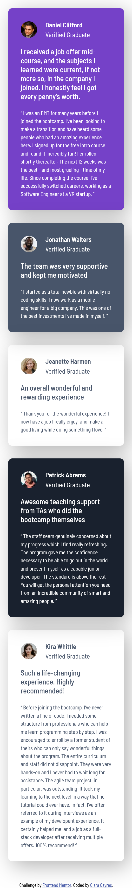

# Frontend Mentor - Testimonials Grid Section Solution

## 🚀 Overview

This is my solution to the [Testimonials Grid Section challenge](https://www.frontendmentor.io/challenges/testimonials-grid-section-Nnw6J7Un7) on Frontend Mentor. The goal was to build a responsive testimonials section using HTML and CSS, matching the provided design as closely as possible.

## 🛠️ Built With

- Semantic HTML5 markup  
- CSS custom properties  
- Flexbox  
- CSS Grid  
- Mobile-first workflow  
- Frontend Mentor starter files  

## 📱 Responsive Design

The layout adapts based on the screen size to ensure a great user experience on both mobile and desktop devices. Grid and Flexbox were combined to create a clean and balanced layout.

## 💡 What I Learned

- How to build complex responsive layouts using CSS Grid and Flexbox together.
- Better understanding of spacing, alignment, and layout structuring.
- Practice with writing clean and semantic HTML.

## 🔗 Links

- Solution URL: [Add your solution link here]()
- Live Site URL: [Add your live site link here](#)

## 📸 Screenshots

### Desktop View

### Mobile View

## 🚧 Future Improvements

- Add hover or focus animations for better interactivity.
- Refactor CSS using a preprocessor like SCSS.
- Make layout adjustments for ultra-wide screens.

## 🙋‍♀️ Author

- GitHub - [@yourusername](https://github.com/yourusername)
- Frontend Mentor - [@yourusername](https://www.frontendmentor.io/profile/yourusername)
- LinkedIn - [Your Name](https://www.linkedin.com/in/yourlinkedin)

## 🎯 Acknowledgments

Thanks to [Frontend Mentor](https://www.frontendmentor.io) for providing such amazing challenges that help developers practice real-world skills!

---
